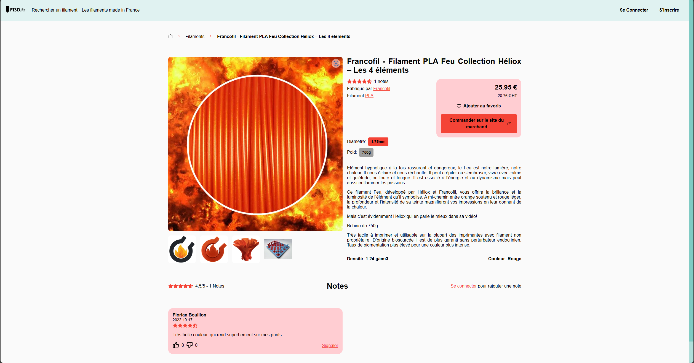

FI3D est un agrégateur de filaments 3D en FDM (Fused Deposition Modeling) disponible sur le marché. Cette plateforme permet de découvrir une large gamme de filaments pour une imprimante 3D, que ce soit pour des projets personnels ou professionnels.

*Image 1 : Image d'impression 3D*

## Collecte de données par le biais du scrapping

FI3D utilise des techniques de scrapping pour récupérer des informations précieuses sur les filaments 3D disponibles sur différents sites web. Cela permet de comparer facilement les caractéristiques, les prix et les avis des utilisateurs, donnant ainsi un aperçu complet des options disponibles sur le marché.

*Image 2 : Page de produit FI3D*

Que l'on soit un utilisateur expérimenté d'imprimantes 3D ou que l'on débute dans ce domaine passionnant, FI3D aide à trouver le filament parfait pour le prochain projet. Explorez une vaste sélection de filaments de haute qualité, provenant de divers fabricants, pour répondre à tous les besoins d'impression 3D.

*Image 3 : Différents types de filaments disponibles sur FI3D*

## Recherchez, Comparez, et Commandez

Naviguer sur FI3D est un jeu d'enfant. Utilisez la fonction de recherche pour trouver le filament qui correspond à vos critères, que ce soit le diamètre, la couleur, le matériau ou la marque. Vous pouvez également consulter les filaments fabriqués en France, si l'on préfère soutenir les produits locaux.

*Image 4 : Recherche de filaments sur FI3D*

Chaque filament est présenté avec une description détaillée, des images et des avis d'utilisateurs pour aider à prendre une décision éclairée. Une fois que l'on a trouvé le filament parfait, il est facile de le commander sur le site du vendeur directement depuis FI3D.

*Image 5 : Page de détails d'un produit FI3D*

FI3D propose également des fonctionnalités pratiques telles que le thème sombre, les favoris pour garder une trace de ses produits préférés, et bien plus encore. L'objectif est de simplifier le processus de recherche et d'achat de filaments 3D pour que l'on puisse se concentrer sur ses projets d'impression.

*Image 6 : Fonction de comparaison de filaments*

## Un Monde de Possibilités

Que l'on travaille sur des prototypes, des maquettes, des objets décoratifs ou des pièces fonctionnelles, FI3D offre un monde de possibilités. Découvrez la polyvalence de l'impression 3D en explorant les différents types de filaments disponibles, des PLA aux ABS en passant par le PETG et bien d'autres.

{/* 
*Image 7 : Objets imprimés en 3D avec différents filaments* */}

**Notez et Partagez Vos Expériences**

Il est encouragé de partager ses expériences et ses avis sur les filaments. Si l'on a utilisé un filament particulier et que l'on souhaite aider d'autres membres de la communauté FI3D, il suffit de laisser une note et un commentaire.

{/* 
*Image 8 : Utilisateur laissant une critique sur un filament* */}

**Inscrivez-vous dès aujourd'hui sur FI3D**

Pour profiter pleinement de toutes les fonctionnalités de FI3D, il est possible de s'inscrire gratuitement sur la plateforme. On pourra ainsi ajouter des filaments à sa liste de favoris, suivre les dernières tendances en matière d'impression 3D et participer à une communauté dynamique de passionnés d'impression 3D.

{/* 
*Image 9: Processus d'inscription sur FI3D* */}

Que l'on soit un professionnel de l'industrie, un bricoleur ou simplement curieux de découvrir le monde de l'impression 3D, FI3D est l'outil idéal pour trouver le filament qui répond à ses besoins.
