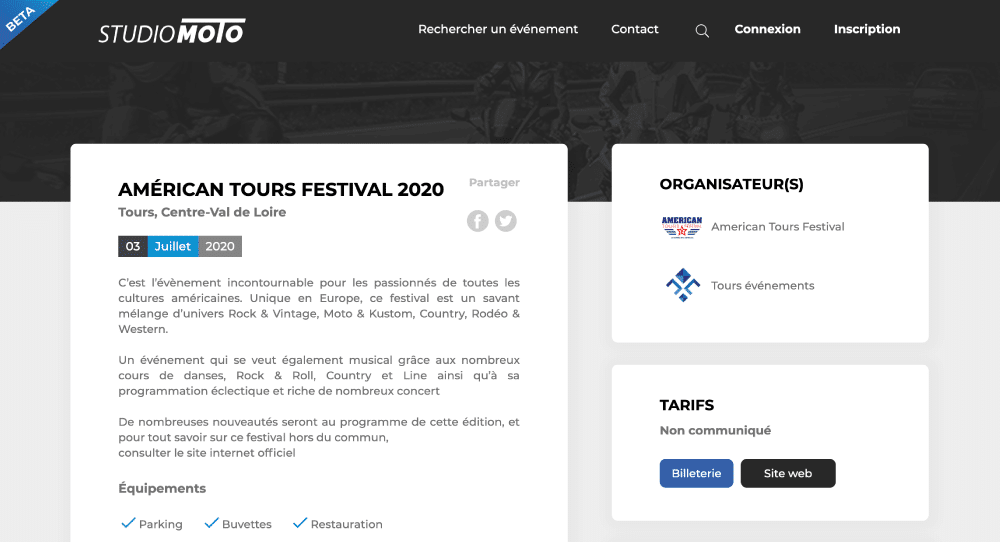
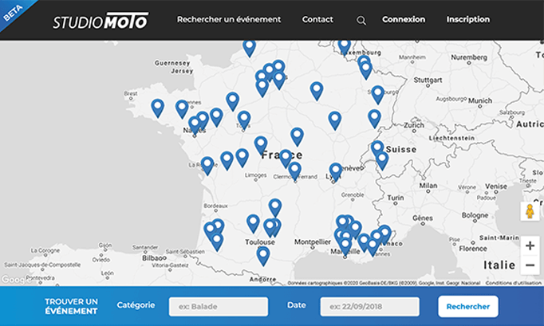

**Studiomoto** est bien plus qu'un simple site web. C'est une véritable plateforme dédiée à l'univers passionnant de la moto en France. Développé par Florian BOUILLON et méticuleusement designé par l'agence Spideer, Studiomoto se positionne en tant qu'acteur majeur dans le domaine de l'événementiel motard.

*Image 1 : Accueil de Studiomoto.fr*

## Une Vitrine des Événements Moto

Studiomoto remplit une mission essentielle : celle de référencer et de communiquer sur les divers événements moto se déroulant à travers la France. Qu'il s'agisse de rassemblements, de salons, de compétitions ou de toute autre manifestation liée à la moto, Studiomoto est la source incontournable pour les amateurs et les passionnés de deux-roues.

La plateforme offre une expérience utilisateur intuitive, permettant aux utilisateurs de rechercher facilement les événements qui les intéressent. Grâce à un moteur de recherche avancé, il est possible de filtrer les événements par date, par région ou même par type, offrant ainsi une personnalisation optimale.

## Une Interface Soignée et Conviviale

L'agence Spideer a relevé le défi de créer un design à la fois moderne, esthétique et fonctionnel pour Studiomoto. Le résultat est une interface élégante qui met en valeur l'ensemble des informations essentielles tout en offrant une expérience visuelle agréable.

La page d'accueil présente de manière attrayante les événements à venir, avec des images percutantes et des descriptions succinctes. Les utilisateurs peuvent ainsi avoir un aperçu rapide de ce qui les attend.

## Contribution à la Communauté Motarde

Studiomoto ne se contente pas de référencer les événements. Il offre également la possibilité aux organisateurs de publier leurs propres événements sur la plateforme. Cette fonctionnalité permet de créer une véritable communauté où chacun peut contribuer à l'enrichissement de l'agenda motard.

Les organisateurs peuvent ajouter des détails complets sur leurs événements, y compris des informations sur la date, l'emplacement, les tarifs et même des liens vers leurs propres sites web ou pages de réseaux sociaux.

## Conclusion

En résumé, Studiomoto est bien plus qu'un simple site de référencement d'événements moto en France. C'est une plateforme dynamique qui rapproche la communauté motarde et met en lumière la richesse de l'univers de la moto dans l'hexagone.

Si vous êtes passionné de deux-roues, que vous soyez un motard chevronné ou un amateur curieux, Studiomoto est l'endroit où vous trouverez les informations essentielles sur les événements moto en France.
