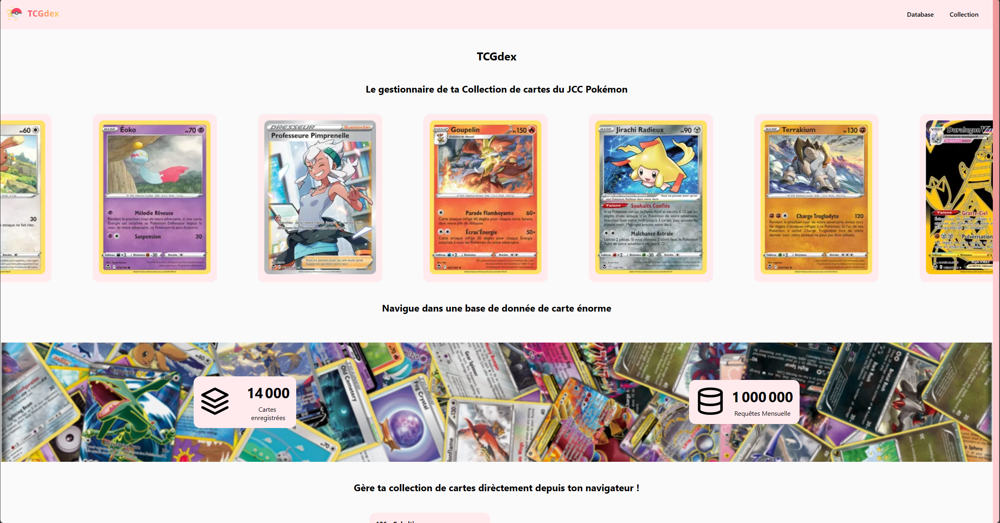
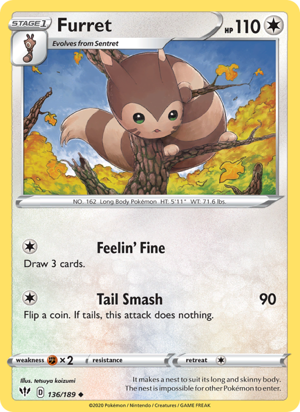

**TCGdex**, l'API du Pokémon JCC (Jeux de Cartes à Collectionner), est une ressource inestimable pour les amateurs du célèbre jeu de cartes Pokémon. Cette API, disponible en six langues (anglais, français, espagnol, portugais, italien, allemand), est un outil open source qui offre une gamme de fonctionnalités impressionnantes aux développeurs et aux fans.

*Image 1 : Page d'accueil du site TCGdex.fr*

## Polyglotte et Inclusif

L'un des aspects les plus impressionnants de TCGdex est sa polyglotterie. L'API prend en charge six langues différentes, ce qui la rend accessible à une audience mondiale. Que vous soyez un développeur cherchant à intégrer TCGdex dans une application multilingue ou un joueur qui préfère consulter les données en sa langue maternelle, TCGdex vous couvre. (Anglais, Français, Espagnol, Italien, Portugais, Allemand)

## Flexibilité Technique

TCGdex offre une flexibilité technique exceptionnelle pour les développeurs. Il est accessible via trois méthodes principales :

1. **API REST** : Les développeurs peuvent interagir avec TCGdex en utilisant des requêtes HTTP standard, ce qui permet une intégration fluide dans n'importe quelle application ou site web.

2. **GraphQL** : Pour ceux qui recherchent une approche plus précise et ciblée, TCGdex propose une interface GraphQL. Cela permet aux utilisateurs de spécifier exactement les données dont ils ont besoin, réduisant ainsi la surcharge d'informations inutiles.

3. **SDKs en Javascript/Typescript & Kotlin/Java** : Pour simplifier encore l'intégration, TCGdex offre des SDKs officiels pour les langages de programmation populaires tels que Javascript/Typescript et Kotlin/Java. Ces SDKs facilitent l'accès aux données de TCGdex et simplifient le processus de développement.

## Formats d'Images Polyvalents

TCGdex ne se limite pas aux données textuelles. Pour une expérience visuelle enrichie, toutes les images de l'API sont disponibles dans plusieurs formats, notamment PNG, JPG et WebP. Que vous ayez besoin d'illustrations pour les cartes Pokémon ou d'images pour les différents éléments du jeu, TCGdex met à disposition une variété d'options pour répondre à vos besoins.

## Conclusion

TCGdex est bien plus qu'une simple API pour le Pokémon JCC. Avec son support multilingue, ses multiples méthodes d'accès, et ses ressources visuelles variées, c'est un outil puissant pour les développeurs et les fans de Pokémon du monde entier. Que vous souhaitiez créer une application, un site web ou simplement explorer les données du jeu, TCGdex est là pour vous.

Que vous soyez un développeur créatif ou un joueur passionné, TCGdex vous offre un accès inégalé aux informations du Pokémon JCC. Explorez ses possibilités, et embarquez pour un voyage inoubliable dans l'univers Pokémon.

*Note : Les informations et les images proviennent de TCGdex. Pour en savoir plus et commencer à utiliser cette API, rendez-vous sur [tcgdex.dev](https://tcgdex.dev).*
